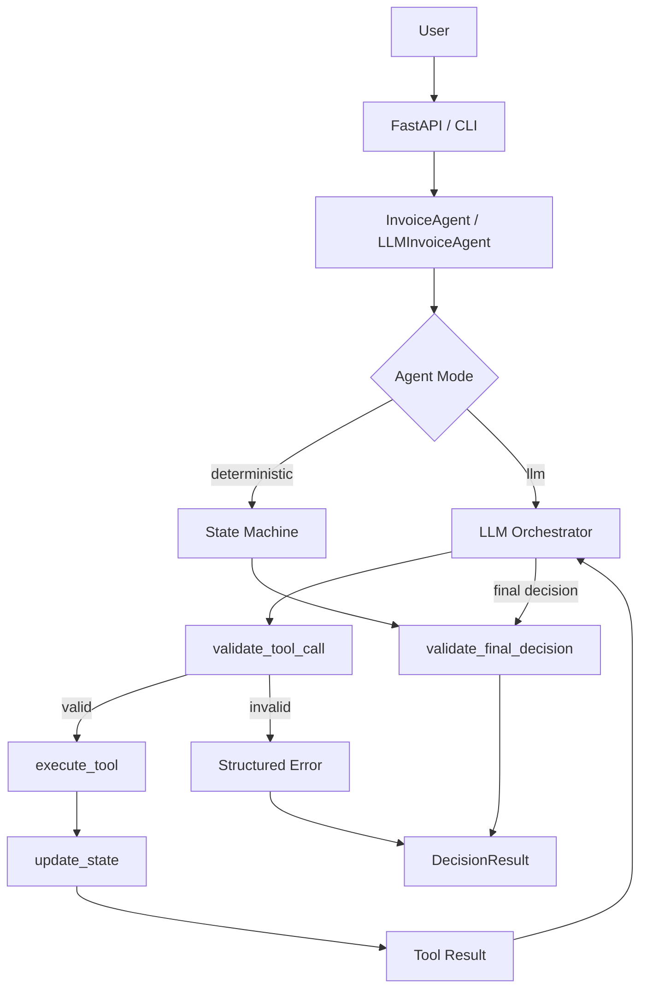
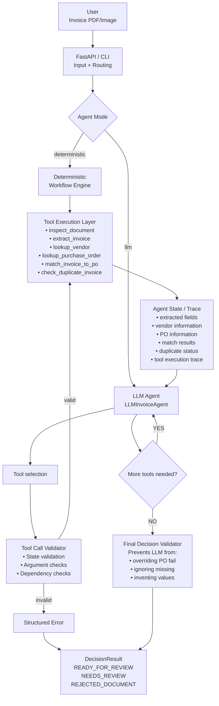
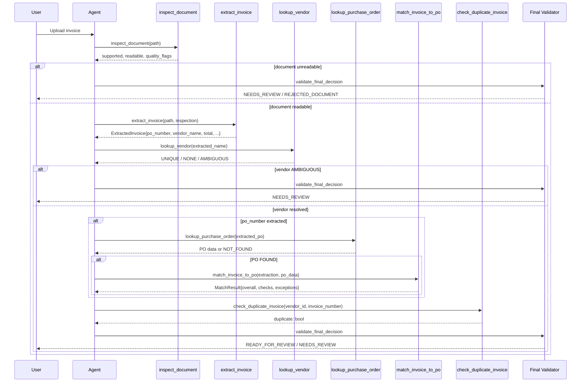
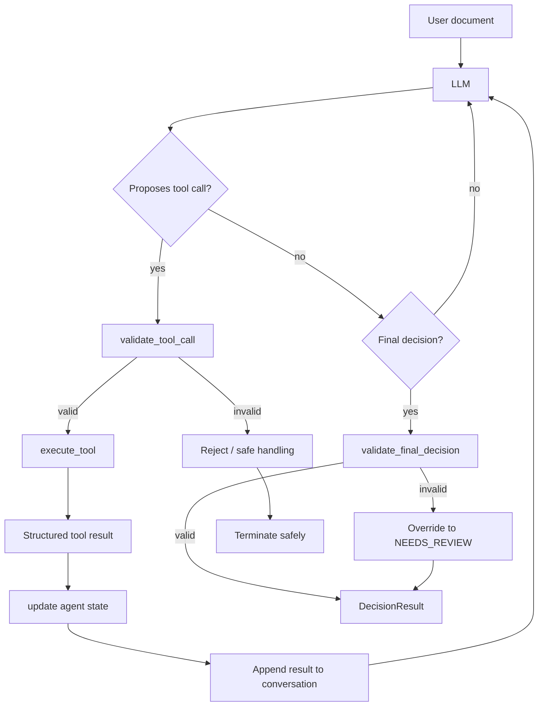
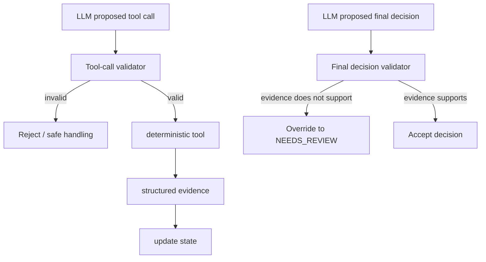

# Invoice Intake & Accounts Payable Exception Triage Agent

An invoice-processing agent that uses deterministic tools to extract and verify invoice information. The agent never invents business facts; all values come from document extraction or deterministic lookup tools.

## 1. What the project does

This system accepts an invoice document (PDF or image), inspects it for usability, extracts structured invoice fields, looks up the vendor and purchase order in deterministic business data, compares the invoice against the PO, checks for duplicates, and returns a structured decision with a full tool trace.

The goal is to demonstrate:

- A real multi-step tool-calling loop where later calls depend on earlier results.
- Structured extraction that preserves uncertainty and never fabricates values.
- Deterministic business validation (vendor, PO, matching, duplicate detection).
- Graceful degradation on blurry, blank, or partial documents.
- Clean agent termination with explicit final statuses.
- Optional LLM orchestration layer that selects tools while deterministic tools remain the source of truth.

## 2. Why invoice intake / AP triage

Invoice processing is a repetitive, high-volume business workflow where:

- A single bad number can cause duplicate payments or missed discounts.
- Missing PO numbers or mismatched totals must be routed to humans.
- Documents vary wildly in quality (scanned, blurry, cropped, rotated).
- Business facts (vendor IDs, PO amounts, expected totals) must come from authoritative systems, not from guessing.

This makes it an ideal domain for evaluating tool-grounded agents.

## 3. Workflow overview

The system implements an **Invoice Intake & Accounts Payable (AP) Exception Triage** workflow. An AP team receives an invoice that must be checked before it can proceed for review or payment processing. The agent automates the initial fact-finding and validation steps, but the final decision is always evidence-constrained.

The workflow in practical business terms:

1. **Receive invoice** — An AP clerk uploads an invoice document.
2. **Inspect document** — The system checks whether the document is usable (supported format, readable, text detected).
3. **Extract information** — Structured fields are extracted from the document: invoice number, dates, vendor, PO reference, amounts, line items, etc.
4. **Identify vendor** — The extracted vendor name is looked up in business data to obtain a vendor ID.
5. **Retrieve purchase order** — If a PO number was extracted, the corresponding PO is retrieved.
6. **Compare invoice to PO** — Quantities, unit prices, totals, and currency are compared deterministically.
7. **Check for duplicates** — The system checks whether the same invoice has already been processed.
8. **Route for review** — Based on the evidence, the invoice is classified as `READY_FOR_REVIEW` (sufficient evidence for human review), `NEEDS_REVIEW` (exceptions found), or `REJECTED_DOCUMENT` (unusable).

The system **never invents** missing invoice information. If a PO number is missing, the system does not look up a fake PO. If the document is blurry, extracted values remain `null` with an appropriate uncertainty status.

## 4. System architecture





### Deterministic mode (default)

A reproducible state-machine workflow that executes the known business workflow without requiring an LLM. The `InvoiceAgent` class maintains explicit `AgentState` and processes tools in a defined sequence, skipping steps when prerequisites are missing.

### LLM mode

The `LLMInvoiceAgent` wraps the same deterministic tools. The LLM acts as an orchestrator that:

- Observes the document and extracted fields.
- Decides which tool to call next using function/tool calling.
- Receives structured tool results.
- Decides whether more evidence is required or if a final decision can be made.

The LLM never becomes the source of truth for business facts. All invoice totals, vendor IDs, PO amounts, and match results come from deterministic tools.

## 5. Detailed tool-calling workflow



### Tool-call dependency example

A critical property of the system is that later tool calls depend on earlier results:

```
extract_invoice
    ↓
po_number = "PO-88021"
    ↓
lookup_purchase_order("PO-88021")
    ↓
PO result: {expected_total: 1250.00, ...}
    ↓
match_invoice_to_po(...)
    ↓
total_match: FAIL
    ↓
NEEDS_REVIEW
```

The PO number passed to `lookup_purchase_order` comes from the extraction result. If extraction returns no PO number, the PO lookup is skipped and the workflow moves toward `NEEDS_REVIEW` rather than inventing a value.

## 6. LLM tool-calling loop

When running in LLM mode, the agent follows this loop:



Key properties:

- **Tool calls are not blindly trusted.** Arguments are validated against the current agent state before execution.
- **Fake PO numbers are rejected.** If the LLM proposes `lookup_purchase_order("PO-FAKE")` but extraction returned `po_number = null`, the call is rejected with `UNSUPPORTED_TOOL_ARGUMENT`.
- **The LLM cannot override deterministic mismatch evidence.** If `match_invoice_to_po` reports `TOTAL_MISMATCH`, the final decision validator will not allow `READY_FOR_REVIEW`.
- **The loop has a maximum tool-call limit** (default: 10). Reaching the limit terminates the workflow as `NEEDS_REVIEW`.
- **Tool failures terminate or route safely** rather than causing fabricated results.

## 7. Extraction pipeline

```text
Document
  ↓
inspect_document
  ↓
PDF/text extraction (pdfplumber)
  ↓
deterministic parsing / regex
  ↓
structured ExtractedInvoice
  ↓
confidence / status / source evidence
```

### Extracted fields

The extraction supports the following fields:

| Field | Type | Description |
|-------|------|-------------|
| `vendor_name` | `InvoiceField` | Extracted vendor name |
| `vendor_tax_id` | `InvoiceField` | Extracted tax ID / GST |
| `invoice_number` | `InvoiceField` | Extracted invoice number |
| `invoice_date` | `InvoiceField` | Extracted invoice date |
| `due_date` | `InvoiceField` | Extracted due date |
| `po_number` | `InvoiceField` | Extracted PO number |
| `currency` | `InvoiceField` | Extracted currency code |
| `payment_terms` | `InvoiceField` | Extracted payment terms |
| `subtotal` | `CurrencyValue` | Extracted subtotal amount |
| `discount` | `CurrencyValue` | Extracted discount amount |
| `tax` | `CurrencyValue` | Extracted tax amount |
| `shipping` | `CurrencyValue` | Extracted shipping amount |
| `total` | `CurrencyValue` | Extracted total amount |
| `amount_due` | `CurrencyValue` | Extracted amount due |
| `line_items` | `List[LineItem]` | Extracted line items |

### Line-item fields

| Field | Type | Description |
|-------|------|-------------|
| `description` | `InvoiceField` | Item description |
| `product_code` | `InvoiceField` | Product code |
| `quantity` | `InvoiceField` | Quantity ordered |
| `unit_price` | `CurrencyValue` | Price per unit |
| `line_total` | `CurrencyValue` | Total for the line |

### Field metadata

Every extracted field preserves:

- `value` — the extracted value (or `null` if missing)
- `confidence` — parser certainty (0.0–1.0); represents parser certainty, not OCR probability
- `status` — one of the statuses below
- `source_text` — the raw text from which the value was extracted
- `source_page` — page number where supported
- `candidates` — alternative values when status is `CONFLICTING`

### Field statuses

| Status | Meaning |
|--------|---------|
| `FOUND` | Value extracted with high confidence. |
| `MISSING` | Field not present in the document. |
| `UNCERTAIN` | Value inferred or derived, not directly extracted. |
| `UNREADABLE` | Document quality prevented reliable extraction. |
| `CONFLICTING` | Multiple candidate values were found. |

## 8. No-hallucination / reliability architecture

The system is designed so that the LLM cannot introduce fabricated business facts:



Key guarantees:

- **Missing values remain null.** If OCR cannot read the invoice number, the field returns `null` with status `MISSING` or `UNREADABLE`.
- **Unreadable fields are not fabricated.** The model cannot turn `INV-10??` into `INV-1002` unless the document evidence supports it.
- **Fake PO references are rejected.** `lookup_purchase_order` arguments are validated against the extracted PO number.
- **Ambiguous vendors are not arbitrarily selected.** If multiple vendors match, the status is `AMBIGUOUS` and the workflow routes to `NEEDS_REVIEW`.
- **PO mismatches cannot be overridden by the LLM.** The final decision validator checks deterministic match results.
- **Duplicate detection is deterministic.** Vendor ID + invoice number is checked against processed invoices.
- **The LLM does not create business facts.** It only decides which tools to call.

## 9. Decision flow

The final decision is one of three statuses:

| Status | Meaning |
|--------|---------|
| `READY_FOR_REVIEW` | Sufficient evidence collected; invoice is ready for human AP review. |
| `NEEDS_REVIEW` | Exceptions found (missing data, mismatches, duplicates, ambiguous vendor, etc.); human intervention required. |
| `REJECTED_DOCUMENT` | Document is unsupported or unreadable; cannot be processed. |

### Decision examples

| Scenario | Outcome |
|----------|---------|
| Clean invoice, all checks pass, no duplicate | `READY_FOR_REVIEW` |
| Missing PO number | `NEEDS_REVIEW` |
| Unknown vendor | `NEEDS_REVIEW` |
| Ambiguous vendor (multiple matches) | `NEEDS_REVIEW` |
| PO total mismatch | `NEEDS_REVIEW` |
| Unit price mismatch | `NEEDS_REVIEW` |
| Quantity mismatch | `NEEDS_REVIEW` |
| Duplicate invoice | `NEEDS_REVIEW` |
| Blurry / unreadable document | `NEEDS_REVIEW` |
| Unsupported format | `REJECTED_DOCUMENT` |
| No text detected in document | `NEEDS_REVIEW` |
| Maximum tool-call limit reached | `NEEDS_REVIEW` |
| Tool execution failure | `NEEDS_REVIEW` |

## 10. Failure and edge-case workflow

| Scenario | System behavior | Expected outcome |
|----------|----------------|------------------|
| Clean invoice | All tools succeed, all checks pass | `READY_FOR_REVIEW` |
| Missing PO number | PO lookup skipped, no PO data to match | `NEEDS_REVIEW` |
| Missing total | Extraction returns `null` total with `MISSING` status | `NEEDS_REVIEW` |
| Blurry document | Inspection flags `BLURRY` or `NO_TEXT_DETECTED` | `NEEDS_REVIEW` |
| Blank document | No text extracted, fields remain `MISSING` | `NEEDS_REVIEW` |
| Partial / cropped document | Some fields extracted, others missing | `NEEDS_REVIEW` |
| Unknown vendor | Vendor lookup returns `NONE` | `NEEDS_REVIEW` |
| Ambiguous vendor | Vendor lookup returns `AMBIGUOUS` | `NEEDS_REVIEW` |
| Wrong quantity | Match detects quantity mismatch | `NEEDS_REVIEW` |
| Wrong unit price | Match detects unit price mismatch | `NEEDS_REVIEW` |
| Wrong total | Match detects total mismatch | `NEEDS_REVIEW` |
| Duplicate invoice | Duplicate check finds existing record | `NEEDS_REVIEW` |
| Same invoice number, different vendor | Duplicate check returns no match | Not a duplicate |
| Vague request with document | Interpreted as invoice processing | Processed normally |
| Vague request without document | No document provided | `NEEDS_REVIEW` |
| Invalid/fake PO proposed by LLM | Validator rejects tool call | `NEEDS_REVIEW` |
| LLM tries to override deterministic mismatch | Final validator prevents override | `NEEDS_REVIEW` |
| Tool failure | Exception caught, `TOOL_FAILURE` recorded | `NEEDS_REVIEW` |
| Maximum tool-call limit | Loop terminates safely | `NEEDS_REVIEW` |

## 11. Concrete end-to-end example

Using actual fixture data (`clean_invoice_03.pdf`):

```text
1. inspect_document
   → supported=true, readable=true, flags=[]

2. extract_invoice
   → invoice_number = INV-8888
   → po_number = PO-88021
   → vendor_name = Acme Supplies Pvt Ltd
   → vendor_tax_id = GST-123
   → total = 1250.00
   → currency = USD
   → line_items: 3 items

3. lookup_vendor("Acme Supplies Pvt Ltd", "GST-123")
   → status = UNIQUE
   → vendor_id = V-101

4. lookup_purchase_order("PO-88021")
   → status = FOUND
   → expected_total = 1250.00
   → line_items: 3 items

5. match_invoice_to_po
   → vendor_match = PASS
   → po_number_match = PASS
   → currency_match = PASS
   → line_items_match = PASS
   → quantity_match = PASS
   → unit_price_match = PASS
   → total_match = PASS
   → overall = PASS

6. check_duplicate_invoice("V-101", "INV-8888")
   → duplicate = false

7. Final validation
   → READY_FOR_REVIEW
```

Tool trace:

```json
[
  {"step": 1, "tool": "inspect_document", "success": true},
  {"step": 2, "tool": "extract_invoice", "success": true},
  {"step": 3, "tool": "lookup_vendor", "success": true},
  {"step": 4, "tool": "lookup_purchase_order", "success": true},
  {"step": 5, "tool": "match_invoice_to_po", "success": true},
  {"step": 6, "tool": "check_duplicate_invoice", "success": true}
]
```

## 12. Why the agent is safe

> "The LLM decides what to ask the tools; the tools decide what is true."

| Layer | Responsibility |
|-------|----------------|
| **LLM** | Orchestration only. Decides which tool to call next. Cannot generate business facts. |
| **Document extraction** | Provides document evidence. Fields carry confidence and status. Missing values stay null. |
| **Vendor / PO lookup** | Provides business evidence from deterministic fixture data. |
| **Matching** | Deterministic comparison of quantities, prices, totals, and currency. |
| **Duplicate check** | Deterministic identity check using vendor_id + invoice_number. |
| **Validators** | Safety boundary. Reject invalid tool arguments. Prevent LLM from overriding deterministic evidence. |
| **Final decision** | Constrained by evidence. Cannot return `READY_FOR_REVIEW` when mismatches or missing data exist. |

This separation ensures that even if the LLM makes a poor orchestration decision, the underlying tools and validators prevent fabricated or unsupported outcomes.

## 13. Project structure

```text
app/
  agent/
    __init__.py
    llm_client.py          # MockLLMClient + OpenAIClient
    llm_orchestrator.py    # LLM-driven agent loop
    orchestrator.py        # Deterministic state machine
    prompts.py             # System prompt
    state.py               # State helpers
    tool_schemas.py        # Tool definitions for LLM function calling
    validators.py          # Argument and final-decision validators
  api/
    routes.py              # FastAPI endpoint
  cli.py                   # CLI entry point
  data/
    processed_invoices.json
    purchase_orders.json
    vendors.json
  main.py                  # FastAPI app factory
  models/
    decision.py            # DecisionResult, MatchResult, ExceptionCode
    invoice.py             # ExtractedInvoice, InvoiceField, CurrencyValue
    tool_result.py         # AgentState, ToolResult
  tools/
    document.py            # inspect_document
    duplicate.py           # check_duplicate_invoice
    extraction.py          # extract_invoice
    matching.py            # match_invoice_to_po
    purchase_order.py      # lookup_purchase_order
    runner.py              # Shared tool execution logic
    vendor.py              # lookup_vendor

tests/
  conftest.py
  fixtures/
    generator.py
  test_agent.py
  test_api.py
  test_edge_cases.py
  test_extraction.py
  test_llm_agent.py
  test_tools.py
```

## 14. Testing and requirement coverage

The repository contains **66 passing tests** covering:

- Document inspection (supported, unsupported, blank, quality flags)
- Extraction (clean, blurry, blank, partial, fields, dates, currency, vendor, tax)
- Vendor lookup (unique, ambiguous, unknown, tax ID filter)
- Purchase order lookup (existing, missing, case insensitive, empty)
- Invoice-to-PO matching (perfect match, total mismatch, unit price mismatch, quantity mismatch, PO not found, ambiguous vendor)
- Duplicate detection (found, not found, different vendor, empty inputs)
- Deterministic agent workflow (clean invoice, missing PO, PO dependency, duplicates, blurry document, ambiguous vendor, termination, max tool calls, tool failure, no repeated calls)
- LLM tool-calling workflow (tool order, PO dependency, hallucination rejection, override prevention, max tool calls)
- API behavior (health, clean invoice, unsupported format, with instruction)
- Edge cases (tool loop proof, no hallucination, mismatch detection, ambiguity handling, clean termination, vague requests)

```bash
python -m pytest tests/ -v
```

## 15. How to install

```bash
python -m venv .venv
.venv\Scripts\activate
pip install -r requirements.txt
```

## 16. How to configure environment variables

Copy `.env.example` to `.env` and set values as needed. No API keys are required for the core functionality (all business data is local fixture data).

```bash
cp .env.example .env
```

Set `AGENT_MODE` to control orchestration:

- `deterministic` — uses the built-in state machine (default, no API key needed).
- `llm` — uses an LLM for tool selection (requires `OPENAI_API_KEY`).

## 17. How to run

### API (FastAPI)

```bash
python -m app.main
# or
uvicorn app.main:app --reload
```

Send a request:

```bash
curl -X POST "http://localhost:8000/process-invoice" -F "file=@invoice.pdf"
```

With LLM mode:

```bash
curl -X POST "http://localhost:8000/process-invoice?mode=llm" -F "file=@invoice.pdf"
```

### CLI

```bash
python -m app.cli path/to/invoice.pdf
python -m app.cli path/to/invoice.pdf --instruction "Check this." --json
python -m app.cli path/to/invoice.pdf --mode llm
```

## 18. Known limitations

- OCR requires Tesseract to be installed separately. Images without a text layer are treated as `NO_TEXT_DETECTED`.
- The extraction layer uses regex-based parsing. It works reliably for well-formatted invoices but may miss fields on heavily stylized documents.
- Business data is stored in local JSON fixtures. In production, vendor and PO lookups would query an ERP.
- The deterministic mode is fully offline and reproducible. The LLM mode requires an OpenAI-compatible API key.

## 19. License

MIT
